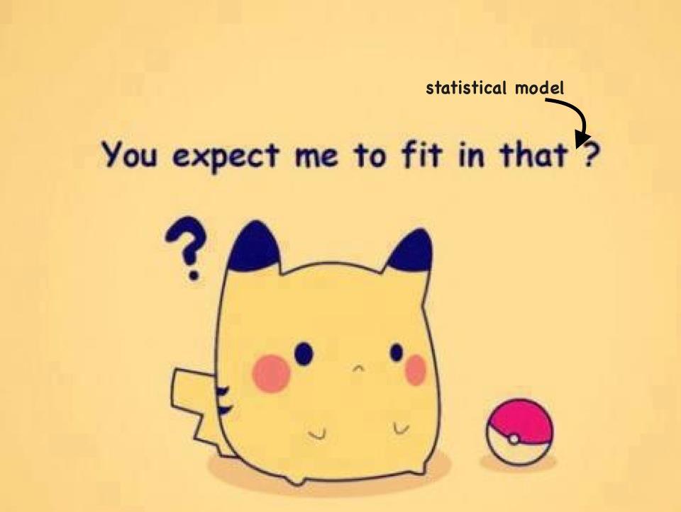

# Pokemon Workshop

## Introduction 

How many Pokemons should a player expect to capture before completing the whole set of 150 different Pokemons? 

This simple question is actually a deeply interesting question in statistics. The expected number of total captures is obviously related to the rarity of Pokemons, but how can we model this process? 

In order to answer this question, we can impose many different assumptions on the capturing process. Surprisingly, in the most simple scenario, there is a very simple solution involving the Harmonic numbers. But if we just tweak the assumptions a little bit, we can arrive at a problem that is quite hard to solve. 

## 2016 Sydney University Mathematics Society Talk

I have written a talk on this topic (with the aid of a lot of Pokemon memes!). The talk blended concepts from statistics and data science. It can be found [here](pokemon_talk_2016.pdf). 

## (Future) Data Science Workshop

Based on 2016 talk, I have written up some materials to demonstrate some data science and computational techniques in statistics using the R language. A future workshop aimed at R enthusiasts and undergraduate students is planned. 